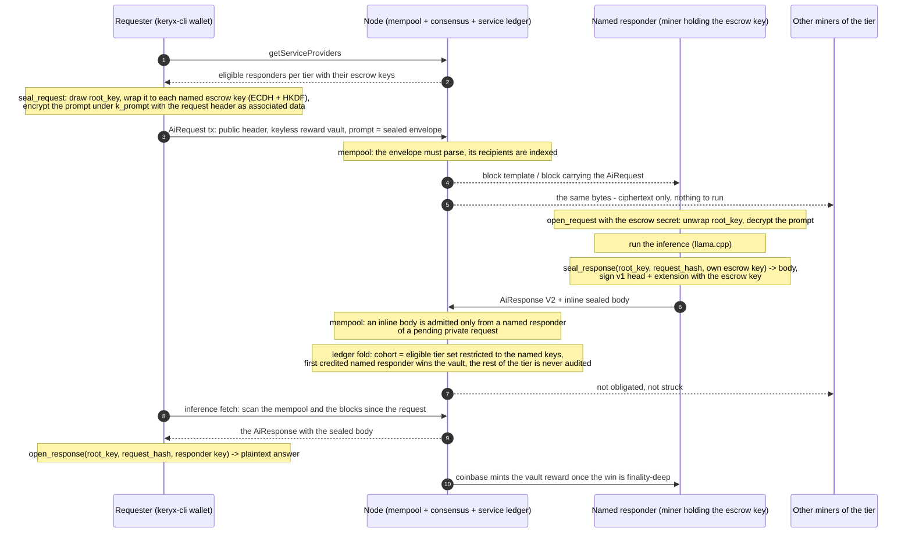
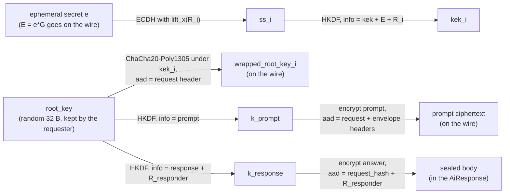

# Private inference — end-to-end encrypted AiRequest / AiResponse

Status: implemented on the node side behind a dormant activation gate
(`private_inference_activation`, `never()` on every network until scheduled). Requester tooling
ships in `keryx-cli` (`inference …`). The miner-side change (open the request, seal the answer)
is specified in §7 and is not part of this repository.

## 1. What it does

A requester seals its prompt to one or more responders — miners identified by the x-only escrow
pubkey they announce in their coinbases (`/escrow:<hex>`) and sign V2 `AiResponse`s with — and a
responder seals its answer back to the requester. Both travel in ordinary transaction payloads,
so they are stored on-chain like every other AI transaction, but only the requester and the named
responders can read them. Everything consensus needs stays public: the request header
(`model_id`, `max_tokens`, `inference_reward`, `priority_fee`), the reward vault, the response
head (`request_hash`, CID, length), the responder identity and its signature.

What changes for the chain, past the gate:

| Layer | Public request (unchanged) | Private request |
|---|---|---|
| Prompt | plaintext in `AiRequest.prompt` | `PrivateRequestEnvelope` in `AiRequest.prompt` (§2) |
| Who must answer | every identity that proved a block of the tier in the eligibility window (the cohort) | the cohort **restricted to the named escrow keys** |
| Who is credited / paid | first credited cohort member | first credited **named** responder |
| Silent responders | struck (escrow burn, suspension at strike 3) | only silent **named** responders are struck |
| Unservable | tier has no eligible identity → request dropped, vault burns | no named responder is eligible → same |
| Answer body | IPFS, CID on-chain | sealed `private_body` inline in the `AiResponse` (§3), CID optional |
| Correctness | not verified on-chain | not verified on-chain (unchanged) |

Everything else — vault output, reward floors, `max_tokens` cap, model caps, mempool dedup,
service windows, strike escalation, reward minting — is untouched.

### Flow



The three responder notes and step 6 are the miner-side changes specified in §7; every other step
is implemented in this repository.

## 2. Request envelope (`inference/src/private.rs`)

The whole `prompt` field of a private `AiRequestPayload` is:

```text
[magic: 4 = 00 'K' 'X' 'P'] [version: 1 = 0x01] [ephemeral_pubkey: 33, compressed secp256k1]
[nonce: 12] [n_recipients: 1, 1..=16]
n × { [escrow_pubkey: 32, x-only, strictly ascending] [wrapped_root_key: 48] }
[ciphertext: ChaCha20-Poly1305(k_prompt, nonce, prompt), ≥ 16 bytes (the tag)]
```

The leading NUL byte never starts a UTF-8 prompt, so no plaintext request is mistaken for an
envelope. `PrivateRequestEnvelope::parse` is strict (version, lengths, a valid ephemeral point,
valid x-only recipient keys in strictly ascending order, room for the tag): **consensus classifies
a request as private iff `parse` succeeds**, so the classification is a pure function of the
bytes. A request that merely wears the magic but fails to parse folds as a *public* request over
opaque bytes (no new block-invalidity rule); the mempool refuses to admit it so a sender never
pays for one.

Sizes: the 4 KB `AiRequest` cap leaves `4044 − 51 − 80·n − 16` bytes of prompt: 3 897 bytes for
one recipient, 2 697 for sixteen (`max_private_prompt_len`).

### Keys

* `root_key` — 32 random bytes drawn by the requester per request; the one secret it keeps
  (`PrivateRequestSecret`, printed once by the CLI).
* Per recipient `i`: `ss_i = ECDH(e, lift_x(R_i))` (libsecp default: SHA-256 of the compressed
  shared point), `kek_i = HKDF-SHA256(salt = "KeryxPrivateInferenceV1", ikm = ss_i,
  info = "kek" ‖ E ‖ R_i)`, `wrapped_root_key_i = ChaCha20-Poly1305(kek_i, nonce, root_key,
  aad = request header)`. `lift_x` is the BIP-340 even-Y lift; a responder whose full key has odd
  Y negates its secret before the ECDH (`open_request` does this).
* `k_prompt = HKDF(salt, ikm = root_key, info = "prompt")`; the prompt AAD is the 52-byte request
  header followed by the envelope header (everything before the ciphertext). Re-parameterizing
  the request (model, tokens, reward, fee), re-addressing it or transplanting a wrapped key from
  another request all fail authentication.
* `k_response = HKDF(salt, ikm = root_key, info = "response" ‖ responder_escrow_pubkey)` —
  distinct per responder, so several named responders answering the same request never share a
  key; a fresh random nonce per envelope keeps a re-published answer safe as well.

Using the escrow (signing) key for ECDH is a deliberate trade-off: it is the only key a miner
already announces on-chain and the one bound to its service identity. Domain-separated HKDF info
keeps the ECDH output independent of the Schnorr signatures made with the same key.

Key material at a glance (one recipient shown, the wrap repeats per named key):



## 3. Response payload extension (`inference/src/ai_payload.rs`)

A V2 (signed, 174-byte) `AiResponse` may append one extension:

```text
[ext_kind: 1 = 0x01 (AI_RESPONSE_EXT_PRIVATE_BODY)] [ext_len: 4 LE] [body: ext_len]
```

with `1 ≤ ext_len ≤ 32 768` (`MAX_AI_RESPONSE_PRIVATE_BODY_LEN`). Valid payload lengths are
therefore exactly 78, exactly 174, or `174 + 5 + ext_len`; anything else fails to deserialize.
The body is a response envelope:

```text
[magic: 4] [version: 1] [nonce: 12] [ciphertext: ChaCha20-Poly1305(k_response, nonce, answer)]
```

with AAD = `request_hash ‖ responder_escrow_pubkey`. **The responder signature covers
`v1 bytes ‖ extension bytes`** (`AiResponsePayload::signed_bytes`), so a relayer cannot swap the
body under a signed head; body-less payloads keep the historical 78-byte signed message, so
every deployed V2 response verifies exactly as before. `response_ipfs_cid` stays a free field: a
responder may also pin the sealed body on IPFS, or put the sha2-256 multihash of the body there.

## 4. Consensus (`consensus/`)

Gate: `Params::private_inference_activation` (`ForkActivation`), plumbed into the virtual
processor. It changes the audit fold — hence the sealed service state — and admits longer
response payloads, so it **must be armed above every live tip before the binary ships**, and
mirrored by the miner release that opens envelopes.

* **Payload length** (`tx_validation_in_isolation.rs`): `MAX_AI_RESPONSE_PAYLOAD_LEN` is now
  32 947 (the isolation check is gate-independent by design).
* **Block rule** (`utxo_validation.rs`): before the gate an `AiResponse` longer than the 174-byte
  V2 form is `AiResponseBodyBeforeActivation` — the rule every un-upgraded node enforces anyway,
  since such a payload does not deserialize for it. After the gate the extension is valid.
* **Service ledger** (`service_bond.rs::service_events_of_chain_block`, `collateral.rs`): after
  the gate a request whose prompt parses as an envelope yields its recipient set (escrow keys →
  `escrow_miner_key`, sorted). `PendingRequest.recipients` carries it; at arming the cohort
  `cohort(tier)` is filtered to pairs whose escrow key is named. Delegations, early responses,
  crediting, the reward win and strikes then flow through the existing code with the smaller
  cohort. An empty filtered set is unservable, exactly like an empty tier.
* **Snapshot encoding** (`ServiceLedgerSnapshot`): encoding byte `2` = encoding `1` plus a
  trailing section `[n: u32] n × [request_hash: 32] [k: u32] [k × escrow key: 32]`, emitted only
  when a pending request carries recipients. Every snapshot without one keeps its historical
  bytes and hash; one byte form per state keeps the encoding canonical (`from_bytes` re-encodes
  and compares). Version-2 bytes without a trailer, or a trailer naming an unknown request, are
  rejected.
* **Mempool admission** (`processor.rs::validate_mempool_transaction_impl`, policy only): before
  the gate a body-carrying response is `AiPayloadTooLong`; after it a request wearing the magic
  must parse (`AiRequestPayloadRule("private-inference envelope: …")`).
* **Mempool admission of bodies** (`mining/src/mempool/validate_and_insert_transaction.rs`,
  policy only): an `AiResponse` with an inline body is admitted only when its responder is a
  named recipient of the request, looked up in the mempool's own private-request index (request
  tx id → recipients, kept while the request sits in the pool) or in the service ledger's pending
  requests (`ConsensusApi::private_request_recipients`). Bodies are up to 32 KiB and
  `AiResponse`s pay no fee, so without this any key could relay large free transactions.
  A response that arrives in the one-block gap between the request leaving the mempool and its
  chain block being folded is rejected with `RejectAiResponseBody`; the miner's in-flight retry
  covers it.

The request identity is the transaction id (post reward-routing gate), as for every request
today; the miner puts it in `AiResponse.request_hash`, and it is the request-side AAD input.

## 5. RPC: `getServiceProviders`

`GetServiceProvidersRequest {}` → `{ virtualDaaScore, providers: [{ tier, modelId, identity,
escrowPubkey }] }`: every identity that proved a block of each tier inside the eligibility window
ending at the sink (the same walk the ledger arms cohorts with), with the escrow key it
announces. This is the list a requester chooses recipients from — a private request to a miner
that is not eligible when the request arms is unservable, so pick keys from this list (several,
for redundancy; up to 16). Op `155`, gRPC message ids `1122`/`1123`; wired through gRPC, wRPC,
the wasm client and `keryx-cli rpc get-service-providers`.

## 6. Requester CLI (`cli/src/modules/inference.rs`)

```text
inference providers [tier]
inference send --to <escrow>[,<escrow>..] --tier <0-4> [--max-tokens N] [--reward KRX] [--fee KRX] [--wait SECS] <prompt | @file>
inference fetch <request id> <root key> [--since <block hash>] [--timeout SECS]
inference decrypt <request id> <root key> <responder escrow> <@file | hex>
```

`send` seals the prompt, funds the request from the open account (inputs covering
`reward + fee + ≥ 1 KRX change`; change at `outputs[0]`, the keyless reward vault at
`outputs[1]`), signs it with the account keys, submits it, and prints the request id, the root
key (the only way to read the answer — keep it) and the sink block to scan from. `--reward`
defaults to the model's floor plus the token surcharge; `--fee` to the 0.3 KRX minimum.
`fetch` (or `send --wait`) polls the mempool and the blocks past `--since` for a signed response
to the request, decrypts the first inline body that opens, and otherwise prints the IPFS CID to
fetch and `decrypt` by hand. The change output is at least 1 KRX because a smaller one pushes
the transaction's KIP-9 storage mass over the standard limit.

## 7. Miner integration (`keryx-miner`, not in this repository)

The miner's vendored `keryx-inference` crate must pick up `private.rs` and the `ai_payload.rs`
changes (the module depends only on `secp256k1`, `chacha20poly1305`, `sha2`, `hmac`, `rand`,
`hex`). Then, in `src/client/grpc.rs`:

1. `scan_txs_for_ai_requests` — after `AiRequestPayload::deserialize`, if `req.is_private()`:
   with an escrow key configured, `keryx_inference::open_request(&req, &escrow_secret)` yields
   the plaintext prompt and the `root_key`; keep the root key with the queued request. Without
   an escrow key, or on `NotARecipient`, skip the request (it is not addressed to this miner and
   the cohort audit will not expect an answer from it). On `Authentication`/`Malformed`, the
   miner is a named recipient of an unreadable request: answer anyway (§4 makes a silent named
   responder strikable), with a plaintext error body — a body that is not an envelope is the
   documented way to say "could not open".
2. Response assembly — after inference: `body = seal_response(&root_key, &request_hash,
   &escrow_pubkey, answer.as_bytes())`, build
   `AiResponsePayload::new(request_hash, window_end, cid, len).with_private_body(body)`, sign
   `signed_bytes()` with `sign_responder` **after** attaching the body, then set `responder`
   (the node's `collateral::responder_signature_message` is the exact digest the miner's
   `sign_responder` must produce; it is unchanged, only its input grew).
   Pinning the sealed body on IPFS is optional; the CID field may carry its multihash.
3. Gate the whole path on `private_inference_activation` the same way `pom_v3_activation` gates
   V2 signing (`keryx_miner::pom::*_activation_daa()`), since a body-carrying response is
   invalid before it.

Pools that dispatch requests to workers (`neuropool`) hold the escrow key at the pool and must
open the envelope there before forwarding the plaintext over stratum.

## 8. Limitations and open points

* Correctness of the answer is not verified on-chain — unchanged from public requests. Privacy
  here means confidentiality and integrity between the two parties, not verified inference.
* The named responder must be service-eligible (a block of the tier in the last eligibility
  window, 3 000 DAA ≈ 5 minutes) when the request arms, one chain block after acceptance. Small
  solo miners are rarely eligible; the CLI's `providers` list is the ground truth. Naming several
  responders is the redundancy lever.
* A named responder can read the prompt, and so can every other responder named on the same
  request. Nobody else — including the node relaying the transaction — can.
* Metadata stays public: the model, token budget, reward, the requester's funding addresses, the
  named responders, the answer length in tokens and the ciphertext sizes.
* The root key printed by `inference send` is the only way to decrypt the answer; the CLI does
  not persist it.
* Inline bodies are capped at 32 KiB; larger answers go through IPFS (sealed with the same
  envelope) and `inference decrypt`.
* Activation scores are `never()` on every network; mainnet and testnet need a scheduled DAA
  above the live tip, released together with a miner that implements §7.

## 9. Tests

* `inference/src/private.rs` — both directions round-trip, one and many recipients, odd-parity
  escrow keys, non-recipients rejected, tampering of ciphertext / header fields / transplanted
  wrapped keys / response fields detected, strict parsing, size limits, randomization.
* `inference/src/ai_payload.rs` — extension round-trip, signed bytes cover the body, malformed
  extensions and a v1 head with an extension rejected, size bounds.
* `consensus/core/src/collateral.rs` — recipient-filtered cohort (credit, reward, no strikes
  for outsiders), silent recipient struck alone, ineligible recipient unservable, early answers
  filtered, snapshot trailer round-trip / canonical form / rejection cases.
* `consensus/src/processes/transaction_validator/tx_validation_in_isolation.rs` — inline-body
  payload lengths in isolation; `consensus/src/pipeline/virtual_processor/tests.rs` — the body
  is refused at mempool admission before the gate and admitted after it.
* `mining/src/manager_tests.rs` — inline bodies admitted only from a named responder of a
  pending private request, and refused again once the request leaves the mempool.
* `rpc/core/src/model/tests.rs` — `getServiceProviders` message serialization mocks;
  `testing/integration/src/rpc_tests.rs` — sanity call over gRPC.
