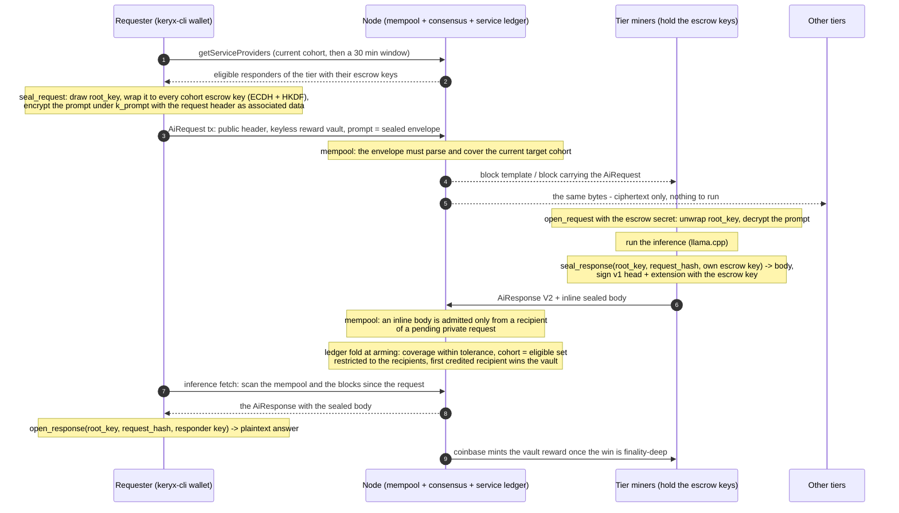
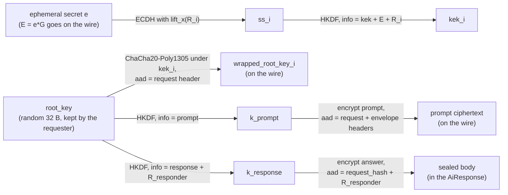

# Private inference — end-to-end encrypted AiRequest / AiResponse

Status: implemented on the node side behind a dormant activation gate
(`private_inference_activation`, `never()` on every network until scheduled). Requester tooling
ships in `keryx-cli` (`inference …`). The miner-side change (open the request, seal the answer)
is specified in §7 and is not part of this repository.

## 1. What it does

From the gate on, every AI request is private. A requester seals its prompt to the **whole
cohort of the requested tier** — the miners that proved a block of the tier inside the
eligibility window, identified by the x-only escrow pubkey they announce in their coinbases
(`/escrow:<hex>`) and sign V2 `AiResponse`s with — and a responder seals its answer back to the
requester. Both travel in ordinary transaction payloads, so they are stored on-chain like every
other AI transaction, but only the requester and the tier's miners can read them. The requester
chooses the tier (the model), never the responders. Everything consensus needs stays public: the
request header (`model_id`, `max_tokens`, `inference_reward`, `priority_fee`), the reward vault,
the response head (`request_hash`, CID, length), the responder identity and its signature.

What changes for the chain, past the gate:

| Layer | Before the gate | From the gate on |
|---|---|---|
| Prompt | plaintext in `AiRequest.prompt` | `PrivateRequestEnvelope` in `AiRequest.prompt` (§2); plaintext is invalid |
| Request size | ≤ 4 096 bytes | ≤ 16 384 bytes |
| Who must answer | the tier cohort | the tier cohort members the request is sealed to; a request missing more than the tolerance of the cohort is unservable (§4) |
| Who is credited / paid | first credited cohort member | first credited sealed-to member |
| Silent responders | struck (escrow burn, suspension at strike 3) | only silent sealed-to members are struck |
| Answer | IPFS, CID on-chain | sealed `private_body` inline in the `AiResponse` (§3); a body-less response is invalid one ledger horizon after the gate |
| Correctness | not verified on-chain | not verified on-chain (unchanged) |

Everything else — vault output, reward floors, `max_tokens` cap, model caps, mempool dedup,
service windows, strike escalation, reward minting — is untouched.

### Flow


```mermaid
sequenceDiagram
    autonumber
    participant R as Requester (keryx-cli wallet)
    participant N as Node (mempool + consensus + service ledger)
    participant M as Tier miners (hold the escrow keys)
    participant O as Other tiers

    R->>N: getServiceProviders (current cohort, then a 30 min window)
    N-->>R: eligible responders of the tier with their escrow keys
    Note over R: seal_request: draw root_key, wrap it to every cohort escrow key (ECDH + HKDF),<br/>encrypt the prompt under k_prompt with the request header as associated data
    R->>N: AiRequest tx: public header, keyless reward vault, prompt = sealed envelope
    Note over N: mempool: the envelope must parse and cover the current target cohort
    N-->>M: block template / block carrying the AiRequest
    N-->>O: the same bytes - ciphertext only, nothing to run
    Note over M: open_request with the escrow secret: unwrap root_key, decrypt the prompt
    Note over M: run the inference (llama.cpp)
    Note over M: seal_response(root_key, request_hash, own escrow key) -> body,<br/>sign v1 head + extension with the escrow key
    M->>N: AiResponse V2 + inline sealed body
    Note over N: mempool: an inline body is admitted only from a recipient<br/>of a pending private request
    Note over N: ledger fold at arming: coverage within tolerance, cohort = eligible set<br/>restricted to the recipients, first credited recipient wins the vault
    R->>N: inference fetch: scan the mempool and the blocks since the request
    N-->>R: the AiResponse with the sealed body
    Note over R: open_response(root_key, request_hash, responder key) -> plaintext answer
    N->>M: coinbase mints the vault reward once the win is finality-deep
```

The three responder notes and step 7 are the miner-side changes specified in §7; every other step
is implemented in this repository.

## 2. Request envelope (`inference/src/private.rs`)

The whole `prompt` field of a private `AiRequestPayload` is:

```text
[magic: 4 = 00 'K' 'X' 'P'] [version: 1 = 0x01] [ephemeral_pubkey: 33, compressed secp256k1]
[nonce: 12] [n_recipients: 1, 1..=128]
n × { [escrow_pubkey: 32, x-only, strictly ascending] [wrapped_root_key: 48] }
[ciphertext: ChaCha20-Poly1305(k_prompt, nonce, prompt), ≥ 16 bytes (the tag)]
```

The leading NUL byte never starts a UTF-8 prompt, so no plaintext request is mistaken for an
envelope. `PrivateRequestEnvelope::parse` is strict (version, lengths, a valid ephemeral point,
valid x-only recipient keys in strictly ascending order, room for the tag), a pure function of
the bytes. From the gate on, an `AiRequest` whose prompt does not parse is invalid (§4).

Sizes: the 16 KB private `AiRequest` cap leaves `16 332 − 51 − 80·n − 16` bytes of prompt:
12 665 bytes for a 45-key cohort, 6 025 for the 128-key maximum (`max_private_prompt_len`).

### Keys

* `root_key` — 32 random bytes drawn by the requester per request; the one secret it keeps
  (`PrivateRequestSecret`, printed once by the CLI).
* Per recipient `i`: `ss_i = ECDH(e, lift_x(R_i))` (libsecp default: SHA-256 of the compressed
  shared point), `kek_i = HKDF-SHA256(salt = "KeryxPrivateInferenceV1", ikm = ss_i,
  info = "kek" ‖ E ‖ R_i)`, `wrapped_root_key_i = ChaCha20-Poly1305(kek_i, nonce, root_key,
  aad = request header)`. `lift_x` is the BIP-340 even-Y lift; a responder whose full key has odd
  Y negates its secret before the ECDH (`open_request` does this).
* `k_prompt = HKDF(salt, ikm = root_key, info = "prompt")`; the prompt AAD is the 52-byte request
  header followed by the envelope header (everything before the ciphertext). Re-parameterizing
  the request (model, tokens, reward, fee), re-addressing it or transplanting a wrapped key from
  another request all fail authentication.
* `k_response = HKDF(salt, ikm = root_key, info = "response" ‖ responder_escrow_pubkey)` —
  distinct per responder, so several named responders answering the same request never share a
  key; a fresh random nonce per envelope keeps a re-published answer safe as well.

Using the escrow (signing) key for ECDH is a deliberate trade-off: it is the only key a miner
already announces on-chain and the one bound to its service identity. Domain-separated HKDF info
keeps the ECDH output independent of the Schnorr signatures made with the same key.

Key material at a glance (one recipient shown, the wrap repeats per named key):


```mermaid
flowchart LR
    e["ephemeral secret e<br/>(E = e*G goes on the wire)"] -->|"ECDH with lift_x(R_i)"| ss["ss_i"]
    ss -->|"HKDF, info = kek + E + R_i"| kek["kek_i"]
    root["root_key<br/>(random 32 B, kept by the requester)"] -->|"ChaCha20-Poly1305 under kek_i,<br/>aad = request header"| wrapped["wrapped_root_key_i<br/>(on the wire)"]
    root -->|"HKDF, info = prompt"| kp["k_prompt"]
    kp -->|"encrypt prompt,<br/>aad = request + envelope headers"| ct["prompt ciphertext<br/>(on the wire)"]
    root -->|"HKDF, info = response + R_responder"| kr["k_response"]
    kr -->|"encrypt answer,<br/>aad = request_hash + R_responder"| body["sealed body<br/>(in the AiResponse)"]
```

## 3. Response payload extension (`inference/src/ai_payload.rs`)

A V2 (signed, 174-byte) `AiResponse` may append one extension:

```text
[ext_kind: 1 = 0x80 (AI_RESPONSE_EXT_PRIVATE_BODY)] [ext_len: 4 LE] [body: ext_len]
```

with `1 ≤ ext_len ≤ 32 768` (`MAX_AI_RESPONSE_PRIVATE_BODY_LEN`). Valid payload lengths are
therefore exactly 78, exactly 174, or `174 + 5 + ext_len`; anything else fails to deserialize.
Byte 174 selects what follows the V2 head: `1..=15` is reserved for the pipeline-link count of
split models, `0x80` for the inline body, which always comes last.
The body is a response envelope:

```text
[magic: 4] [version: 1] [nonce: 12] [ciphertext: ChaCha20-Poly1305(k_response, nonce, answer)]
```

with AAD = `request_hash ‖ responder_escrow_pubkey`. **The responder signature covers
`v1 bytes ‖ extension bytes`** (`AiResponsePayload::signed_bytes`), so a relayer cannot swap the
body under a signed head; body-less payloads keep the historical 78-byte signed message, so
every deployed V2 response verifies exactly as before. `response_ipfs_cid` stays a free field: a
responder may also pin the sealed body on IPFS, or put the sha2-256 multihash of the body there.

## 4. Consensus (`consensus/`)

Gate: `Params::private_inference_activation` (`ForkActivation`). It changes the audit fold —
hence the sealed service state — and the validity of AI transactions, so it **must be armed above
every live tip before the binary ships**, and mirrored by the miner release that opens envelopes.

* **Payload lengths in isolation** (`tx_validation_in_isolation.rs`, gate-independent):
  `AiRequest` up to 16 384 bytes, `AiResponse` up to 32 947 bytes.
* **Era rules** (`processes/private_inference.rs`, checked in `body_validation_in_isolation.rs`
  against the block's own DAA score, trusted blocks included):
  * before the gate, an `AiRequest` above 4 096 bytes (`AiRequestTooLongBeforeActivation`) or an
    `AiResponse` above the 174-byte V2 form (`AiResponseBodyBeforeActivation`) invalidates the
    block — the verdict a node without private inference reaches in isolation;
  * from the gate on, an `AiRequest` whose prompt is not a well-formed envelope invalidates the
    block (`AiRequestNotPrivate`);
  * from the gate plus `SERVICE_LEDGER_HORIZON_DAA` on, an `AiResponse` without an inline body
    invalidates the block (`AiResponseWithoutPrivateBody`). The horizon lets requests accepted
    before the gate still be answered the old way.
* **Service ledger** (`service_bond.rs::service_events_of_chain_block`, `collateral.rs`): after
  the gate a request's envelope yields its recipient set (escrow keys → `escrow_miner_key`,
  sorted) and its first input's outpoint yields its cohort seed (`private_cohort_seed`).
  `PendingRequest.recipients` and `PendingRequest.cohort_seed` carry them. At arming, with `C` the
  cohort's escrow keys and `T = private_target_cohort(seed, C)` — `C` itself up to
  `PRIVATE_COHORT_TARGET` (128) keys, else the 128 keys of lowest
  `BLAKE2b-256("KeryxPrivateCohortV1" ‖ seed ‖ key)`: if more than
  `private_cohort_tolerance(|T|) = max(3, ⌈|T|/4⌉)` of `T` are not recipients, the request is
  unservable (dropped, nobody obligated or struck, the vault never minted); otherwise
  the cohort is filtered to the recipients. Delegations, early responses, crediting, the reward
  win and strikes then flow through the existing code. The tolerance covers miners that enter the
  cohort between sealing and arming.
* **Snapshot encoding** (`ServiceLedgerSnapshot`): encoding byte `2` = encoding `1` plus a
  trailing section `[n: u32] n × [request_hash: 32] [cohort seed: 36] [k: u32] [k × escrow key: 32]`,
  emitted only
  when a pending request carries recipients. Every snapshot without one keeps its historical
  bytes and hash; one byte form per state keeps the encoding canonical (`from_bytes` re-encodes
  and compares). Version-2 bytes without a trailer, or a trailer naming an unknown request, are
  rejected.
* **Mempool admission** (`processor.rs::validate_mempool_transaction_impl`): the era rules above,
  evaluated at the virtual DAA score.
* **Mempool admission policy** (`mining/src/mempool/validate_and_insert_transaction.rs`):
  * a private `AiRequest` must be sealed to every escrow key of the target cohort (seeded by its
    first input) its tier would arm with at the sink (`ConsensusApi::private_cohort_escrows`), and
    is refused for an empty tier
    (`RejectPrivateRequestCoverage`, `RejectPrivateRequestEmptyCohort`);
  * an `AiResponse` with an inline body is admitted only when its responder is a recipient of the
    request, looked up in the mempool's own private-request index (request tx id → recipients,
    kept while the request sits in the pool) or in the service ledger's pending requests
    (`ConsensusApi::private_request_recipients`). A response that arrives in the one-block gap
    between the request leaving the mempool and its chain block being folded is rejected with
    `RejectAiResponseBody`; the miner's in-flight retry covers it.

The request identity is the transaction id (post reward-routing gate), as for every request
today; the miner puts it in `AiResponse.request_hash`, and it is the request-side AAD input.

## 5. RPC: `getServiceProviders`

`GetServiceProvidersRequest { windowDaa? }` → `{ virtualDaaScore, providers: [{ tier, modelId,
identity, escrowPubkey }] }`: every identity that proved a block of each tier inside the window
ending at the sink (the same walk the ledger arms cohorts with), with the escrow key it announces.
Without `windowDaa` the window is the eligibility window — the cohort a request must cover; a
wider `windowDaa` (at most `MAX_SERVICE_PROVIDERS_WINDOW_DAA` = 36 000) also returns miners that
were active recently, so a requester can seal to them too. Op `156`, gRPC message ids
`1124`/`1125`; wired through gRPC, wRPC, the wasm client and `keryx-cli rpc get-service-providers`.

## 6. Requester CLI (`cli/src/modules/inference.rs`)

```text
inference providers [tier]
inference send --tier <0-4> [--max-tokens N] [--reward KRX] [--fee KRX] [--wait SECS] <prompt | @file>
inference fetch <request id> <root key> [--since <block hash>] [--timeout SECS]
inference decrypt <request id> <root key> <responder escrow> <@file | hex>
```

`send` selects the funding inputs first (the first one seeds the target cohort), seals the prompt
to the target cohort of the tier, completed by rank with the tier's providers of the last 18 000
DAA (~30 min) up to the 128-key cap, funds the request from the open account (inputs covering `reward + fee + ≥ 1 KRX change`; change at `outputs[0]`, the keyless
reward vault at `outputs[1]`), signs it with the account keys, submits it, and prints the request
id, the root key (the only way to read the answer — keep it) and the sink block to scan from. It
refuses to send when no miner of the tier is eligible. `--reward` defaults to the floor in force at the
node's DAA: the model's base plus the token surcharge, or the model's fixed price once
`private_inference_activation` (H14) is live (0.5 KRX for tier 0, 0.5 KRX more per tier, whatever
`--max-tokens`, plus the fee);
`--fee` to the 0.3 KRX minimum. `fetch` (or `send --wait`) polls the
mempool and the blocks past `--since` for a signed response to the request, decrypts the first
inline body that opens, and otherwise prints the IPFS CID to fetch and `decrypt` by hand. The
change output is at least 1 KRX because a smaller one pushes the transaction's KIP-9 storage mass
over the standard limit.

## 7. Miner integration (`keryx-miner`, not in this repository)

The miner's vendored `keryx-inference` crate must pick up `private.rs` and the `ai_payload.rs`
changes (the module depends only on `secp256k1`, `chacha20poly1305`, `sha2`, `hmac`, `rand`,
`hex`). Then, in `src/client/grpc.rs`:

1. `scan_txs_for_ai_requests` — after `AiRequestPayload::deserialize`, if `req.is_private()`:
   with an escrow key configured, `keryx_inference::open_request(&req, &escrow_secret)` yields
   the plaintext prompt and the `root_key`; keep the root key with the queued request. Without
   an escrow key, or on `NotARecipient`, skip the request (the miner joined the cohort after the
   request was sealed; the audit will not expect an answer from it). On
   `Authentication`/`Malformed`, the miner is a recipient of an unreadable request: answer anyway
   (§4 makes a silent recipient strikable), with a plaintext error body — a body that is not an
   envelope is the documented way to say "could not open".
2. Response assembly — after inference: `body = seal_response(&root_key, &request_hash,
   &escrow_pubkey, answer.as_bytes())`, build
   `AiResponsePayload::new(request_hash, window_end, cid, len).with_private_body(body)`, sign
   `signed_bytes()` with `sign_responder` **after** attaching the body, then set `responder`
   (the node's `collateral::responder_signature_message` is the exact digest the miner's
   `sign_responder` must produce; it is unchanged, only its input grew).
   Pinning the sealed body on IPFS is optional; the CID field may carry its multihash. The
   plaintext answer is never published.
3. Gate the whole path on `private_inference_activation` the same way `pom_v3_activation` gates
   V2 signing (`keryx_miner::pom::*_activation_daa()`): a body-carrying response is invalid
   before the gate, and a body-less one one ledger horizon after it.

Pools that dispatch requests to workers (`neuropool`) hold the escrow key at the pool and must
open the envelope there before forwarding the plaintext over stratum.

Every client that sends requests (wallets, extension, keryx-api, agents) must seal them before
the gate, and every reader of AI transactions (indexer, explorer, wallets) must accept the
`174 + 5 + len` response form and requests up to 16 KB.

## 8. Limitations

* Correctness of the answer is not verified on-chain — unchanged from public requests. Privacy
  here means confidentiality and integrity between the requester and the tier's miners, not
  verified inference.
* Every miner of the tier can read the prompt (about 45 keys on the busiest tier in September
  2026), or the 128 of its target cohort once the tier is larger. Nobody else — including the
  node relaying the transaction — can.
* Metadata stays public: the model, token budget, reward, the requester's funding addresses, the
  recipient keys, the answer length in tokens and the ciphertext sizes.
* A request pays for its envelope: about 80 bytes per cohort member, so requests are several KB.
* The root key printed by `inference send` is the only way to decrypt the answer; the CLI does
  not persist it.
* Inline bodies are capped at 32 KiB; larger answers go through IPFS (sealed with the same
  envelope) and `inference decrypt`.
* Activation scores are `never()` on every network; mainnet and testnet need a scheduled DAA
  above the live tip, released together with a miner that implements §7 and updated clients.

## 9. Tests

* `inference/src/private.rs` — both directions round-trip, one and many recipients (up to 128),
  odd-parity escrow keys, non-recipients rejected, tampering of ciphertext / header fields /
  transplanted wrapped keys / response fields detected, strict parsing, size limits,
  randomization.
* `inference/src/ai_payload.rs` — extension round-trip, signed bytes cover the body, malformed
  extensions (including the pipeline-link byte range) and a v1 head with an extension rejected,
  size bounds.
* `consensus/core/src/collateral.rs` — target cohort (all keys up to the cap, lowest ranks above,
  order-independent, seed-dependent), coverage against it above the cap, coverage tolerance,
  recipient-filtered cohort (credit,
  reward, no strikes for outsiders), under-covered request unservable, silent recipient struck
  alone, ineligible recipient unservable, early answers filtered, snapshot trailer round-trip /
  canonical form / rejection cases.
* `consensus/src/processes/private_inference.rs` — era rules on both sides of the gate and of the
  ledger horizon.
* `consensus/src/processes/transaction_validator/tx_validation_in_isolation.rs` — request and
  inline-body payload lengths in isolation; `consensus/src/pipeline/virtual_processor/tests.rs` —
  the body is refused at mempool admission before the gate and admitted after it; oversized
  requests before the gate and plaintext requests after it invalidate the block.
* `mining/src/manager_tests.rs` — cohort coverage at admission, target-cohort coverage above the
  cap; inline bodies admitted only from a
  recipient of a pending private request, and refused again once the request leaves the mempool.
* `rpc/core/src/model/tests.rs` — `getServiceProviders` message serialization mocks;
  `testing/integration/src/rpc_tests.rs` — sanity call over gRPC.
